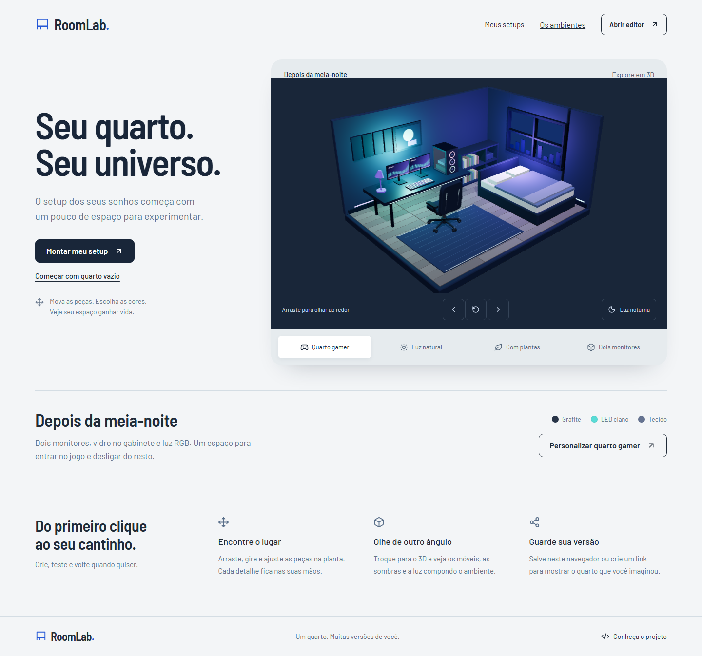

# RoomLab

Editor de quartos e setups para experimentar móveis, cores e iluminação. Organize as peças em uma planta interativa e explore a mesma composição em 3D.

**[Experimentar a demo](https://samuelsce.github.io/RoomLab/) · [Abrir o quarto gamer](https://samuelsce.github.io/RoomLab/#/editor?scene=gamer) · [English](README.en.md)**



Projeto de portfólio front-end de [@samuelsce](https://github.com/samuelsce), com foco em interfaces responsivas, interação gráfica, estado complexo e persistência no navegador. A versão atual está em `main`; novas mudanças são desenvolvidas em branches e revisadas por pull request.

## Conheça o projeto em dois minutos

1. Abra o [quarto gamer](https://samuelsce.github.io/RoomLab/#/editor?scene=gamer), gire a câmera e experimente a luz natural/noturna.
2. Escolha **Planta 2D**, selecione uma peça e arraste, gire ou altere a cor pelo painel de propriedades.
3. Adicione um objeto pelo catálogo. Use **Desfazer** para comparar com a composição anterior.
4. Dê um nome ao quarto, clique em **Salvar** e reabra em **Meus setups**.
5. Use **Compartilhar → Gerar link** e abra o endereço em outro navegador. O quarto pode ser visto sem login e copiado para edição.

Para avaliar o código, comece pelo [guia de avaliação técnica](docs/AVALIACAO.md) e pela [arquitetura](docs/ARQUITETURA.md).

## Funcionalidades

- Quatro ambientes de partida, incluindo quarto gamer, e um quarto vazio.
- Catálogo de 13 peças, busca sem distinção de acentos e filtros por categoria.
- Adição por clique/toque ou arrasto na planta, seleção, movimento, rotação, tamanho e cores.
- Duplicação, exclusão, camadas, grade e histórico de desfazer/refazer por ação.
- Visualização 3D com mobiliário volumétrico, materiais, sombras, câmera e controles de luz.
- Interface responsiva, atalhos, foco visível, mensagens de estado e preferência por movimento reduzido.
- Biblioteca local: nomear, salvar, reabrir, duplicar e excluir, com validação e detecção de versões desatualizadas entre abas.
- Importação/exportação JSON, PNG da vista atual e links com uma cópia fixa do quarto.

## Decisões que vale inspecionar

| Problema | Solução implementada | Onde ler |
| --- | --- | --- |
| Arrastar com zoom e manter peças giradas dentro do quarto | Conversão de coordenadas e limites geométricos independentes da tela | [geometry.ts](src/features/editor/geometry.ts), [RoomScene.tsx](src/features/editor/RoomScene.tsx) |
| Desfazer um arrasto sem guardar cada movimento do ponteiro | Estado transitório do gesto e uma entrada de histórico ao concluir | [editorModel.ts](src/features/editor/editorModel.ts) |
| Exibir a mesma composição em duas vistas | Documento único com projeção da planta para o modelo 3D | [projection.ts](src/features/room3d/projection.ts), [models.ts](src/features/room3d/models.ts) |
| Salvar sem perder dados quando o armazenamento falha | Validação de entrada, mensagens de erro e comparação de revisões | [storage.ts](src/features/setups/storage.ts) |
| Compartilhar em uma hospedagem estática | JSON validado, gzip e base64url no endereço, sem servidor de aplicação | [codec.ts](src/features/sharing/codec.ts) |
| Evitar renderização gráfica contínua em repouso | Renderizar quando a cena, câmera, luz ou viewport mudam; liberar recursos ao sair | [RoomCanvas.tsx](src/features/room3d/RoomCanvas.tsx) |

## Tecnologias

React 19, TypeScript, Vite, React Router, Three.js, SVG e CSS. Lucide fornece os ícones; Barlow e Barlow Semi Condensed são servidas localmente pelo Fontsource. Playwright valida os fluxos no navegador, e `node:test` cobre regras de estado, geometria e documentos. As versões reproduzíveis estão no `package-lock.json`.

## Executar localmente

Requisitos: Git, Node.js **22.12 ou superior** e npm. O workflow utiliza Node.js 24.

```sh
git clone https://github.com/samuelsce/RoomLab.git
cd RoomLab
npm ci
npm run dev
```

Abra a URL mostrada no terminal. Não é necessário cadastrar serviços, configurar banco de dados ou fornecer chaves de API. As configurações opcionais de rota e base estão em [.env.example](.env.example).

Para gerar e visualizar o build:

```sh
npm run build
npm run preview
```

## Qualidade e testes

```sh
npm run lint
npm run typecheck
npm run format:check
npm run test:unit
npx playwright install chromium
npm run test:e2e -- --workers=2
npm run test:pages -- --workers=2
npm run build
```

A validação local do [refinamento 3D](docs/REFINAMENTO-3D.md) aprovou **26 testes unitários, 72 casos de navegador e 2 casos do build de Pages**. Seis casos adicionais são ignorados nos perfis em que não se aplicam. Os perfis de desktop, tablet e celular usam Chromium; não representam certificação em dispositivos físicos ou em todos os navegadores.

O [workflow](.github/workflows/pages.yml) executa lint, formatação, testes e build antes de publicar. [Execução validada da entrega 3D](https://github.com/samuelsce/RoomLab/actions/runs/37417938419). `npm run test:live` verifica a demo pública, o 3D gamer, compartilhamento em sessão independente e cópia editável.

## Dados e limites

O salvamento é manual e local ao navegador. Limpar os dados do site remove a biblioteca; exporte JSON para manter um backup. O limite é de **30 setups**, com até **100 objetos** em cada um.

Um link contém o nome e a composição do quarto. Quem tiver o endereço completo pode abrir essa versão, e edições posteriores não modificam o link já gerado. Não há login, banco, sincronização entre dispositivos ou serviço de links curtos. O conteúdo compactado do link é limitado a 12.000 caracteres; JSON oferece uma alternativa para quartos maiores.

O 3D é estilizado e as dimensões são ilustrativas. A planta posiciona as peças; o 3D permite explorar e editar pelas propriedades/lista. Luz e câmera são preferências temporárias de visualização. Sem suporte gráfico, a planta continua disponível. Veja os [limites e tradeoffs da arquitetura](docs/ARQUITETURA.md).

## Documentação

| Documento | Para quem é útil |
| --- | --- |
| [Guia de avaliação](docs/AVALIACAO.md) | Quem quer testar o produto e encontrar evidências no código |
| [Arquitetura e decisões](docs/ARQUITETURA.md) | Quem quer entender estado, geometria, 3D, armazenamento e links |
| [Desenvolvimento](docs/DESENVOLVIMENTO.md) | Quem quer executar, verificar e acompanhar o fluxo de trabalho |
| [Contribuição](CONTRIBUTING.md) | Quem quer reportar problemas ou propor uma mudança |
| [Histórico das entregas](docs/README.md) | Quem quer acompanhar a evolução e os guias de aprendizado |
| [Créditos](docs/CREDITOS.md) | Quem quer consultar a origem dos assets e as licenças das dependências |

## Autor e processo

Projeto de [@samuelsce](https://github.com/samuelsce), desenvolvido de forma incremental, com apoio de um assistente de IA para planejamento e implementação. O histórico registra mudanças por responsabilidade; os documentos registram decisões, verificações e exercícios para compreender e evoluir o código.
