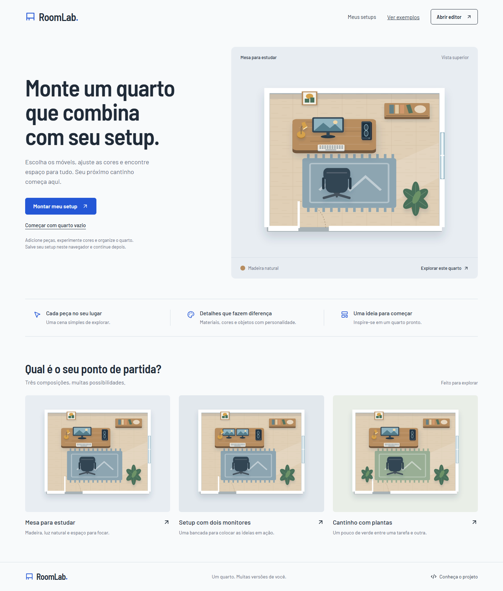

# RoomLab: monte seu setup

Projeto de portfólio front-end: um editor visual para montar e personalizar um quarto com um setup de trabalho ou jogos.

Status: quarta entrega implementada, com editor, biblioteca local e compartilhamento por link. Desenvolvimento em `feat/setup-sharing`.

**[Experimentar a demo no GitHub Pages](https://samuelsce.github.io/RoomLab/)**



## O que já funciona

- Home responsiva e navegação para o editor.
- Três quartos demonstrativos e uma cena vazia.
- Catálogo de 12 peças, busca com ou sem acento e filtros por categoria.
- Seleção pela cena ou lista, detalhes dos objetos e zoom.
- Adicionar por clique/toque ou arrasto do catálogo no desktop.
- Mover com mouse/toque ou teclado, girar, redimensionar e trocar cores.
- Duplicar, excluir, ordenar camadas, alinhar à grade e desfazer/refazer.
- Layout de três áreas no desktop e painéis alternáveis no mobile.
- Nomear, salvar, reabrir, duplicar e excluir setups locais com miniaturas.
- Exportar/importar backup JSON validado e baixar PNG da composição.
- Aviso de edições pendentes, erros de armazenamento e conflitos entre versões de abas.
- Gerar link com uma cópia fixa do quarto, abrir sem dados locais e editar uma cópia independente.

Use **Salvar** após editar. Os setups ficam no armazenamento deste navegador, limitados a 30 quartos de até 100 objetos cada. Recarregar reabre a última versão salva; limpar os dados do site exclui os setups. Exporte JSON para guardar um backup ou levar a outro dispositivo. **Compartilhar** gera um link com a composição atual, independente do salvamento local. Quem tiver o endereço inteiro pode abrir a cópia. As dimensões do quarto são ilustrativas; posições e tamanhos dos objetos usam unidades do desenho.

## Rodar localmente

Requer Node.js 22.12+ e npm. Node.js 24 foi utilizado na validação.

```sh
npm ci
npm run dev
```

Abra o endereço mostrado no terminal. As rotas principais são `/`, `/editor` e `/setups`. Os exemplos também podem ser abertos diretamente em `/editor?scene=study`, `dual`, `plants` ou `empty`. Um setup salvo abre em `/editor?setup=<id>` no mesmo navegador e endereço do site.

## Verificar

```sh
npm run lint
npm run typecheck
npm run build
npm run format:check
npm run test:unit
npx playwright install chromium
npm run test:e2e -- --workers=2
npm run test:pages
```

Os testes usam Chromium em tamanhos de desktop, tablet e celular; isso não representa validação em dispositivos físicos ou em todos os navegadores. Para atualizar as capturas, mantenha o servidor local na porta 5173 e execute `npm run capture:preview`.

## Tecnologias

React, TypeScript, Vite, React Router, CSS com tokens, SVG, Lucide e Playwright. As fontes Barlow e Barlow Semi Condensed são servidas localmente pelo Fontsource. Versões reproduzíveis registradas no lockfile.

## Objetivo

Demonstrar interfaces responsivas, manipulação gráfica, estado complexo, acessibilidade, persistência e cuidado com experiência de uso. O desenvolvimento será incremental, com explicações e commits por responsabilidade.

## Documentação

- [Plano do projeto](docs/PLANO.md)
- [Referências e direção visual](docs/REFERENCIAS.md)
- [Fluxo de desenvolvimento e aprendizado](docs/DESENVOLVIMENTO.md)
- [Primeira entrega: decisões, verificação e guia de aprendizado](docs/ENTREGA-01.md)
- [Segunda entrega: geometria, interações e histórico](docs/ENTREGA-02.md)
- [Terceira entrega: persistência, biblioteca e backups](docs/ENTREGA-03.md)
- [Quarta entrega: links e GitHub Pages](docs/ENTREGA-04.md)
- [Créditos dos assets](docs/CREDITOS.md)

## Versionamento

A `main` recebe entregas revisadas. Planejamento e implementação acontecem em branches específicas. A proteção automática da `main` ainda não foi configurada no GitHub.

Repositório: [samuelsce/RoomLab](https://github.com/samuelsce/RoomLab). A demo está publicada no GitHub Pages. O [workflow da quarta entrega](https://github.com/samuelsce/RoomLab/actions/runs/37413959090) terminou com sucesso. O endereço real foi verificado com compartilhamento em sessão independente, edição de cópia e recarregamento. Novas publicações passam pelos checks do workflow.

No Pages, o aplicativo usa rotas com `#`, como `/RoomLab/#/editor`, para recarregar sem precisar de servidor de rotas. Links compartilhados usam `/RoomLab/#/setup?data=v1...`. A composição é compactada no próprio endereço; não há banco, chaves secretas ou links curtos nesta versão. O limite é 12.000 caracteres para o conteúdo do link. Veja os limites e a configuração em [ENTREGA-04.md](docs/ENTREGA-04.md).
