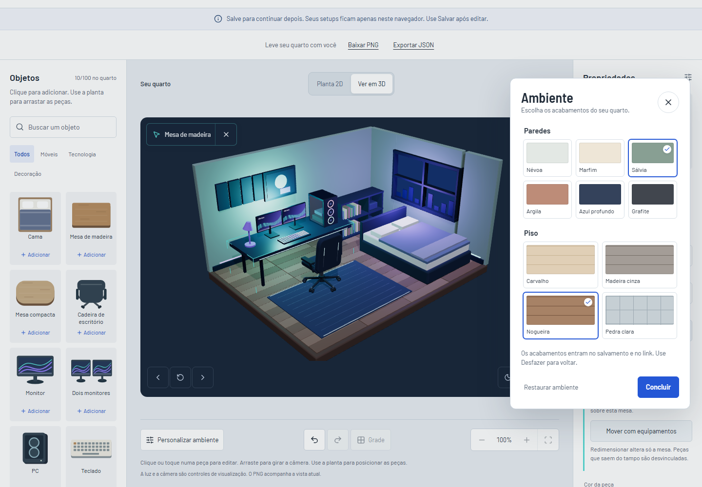
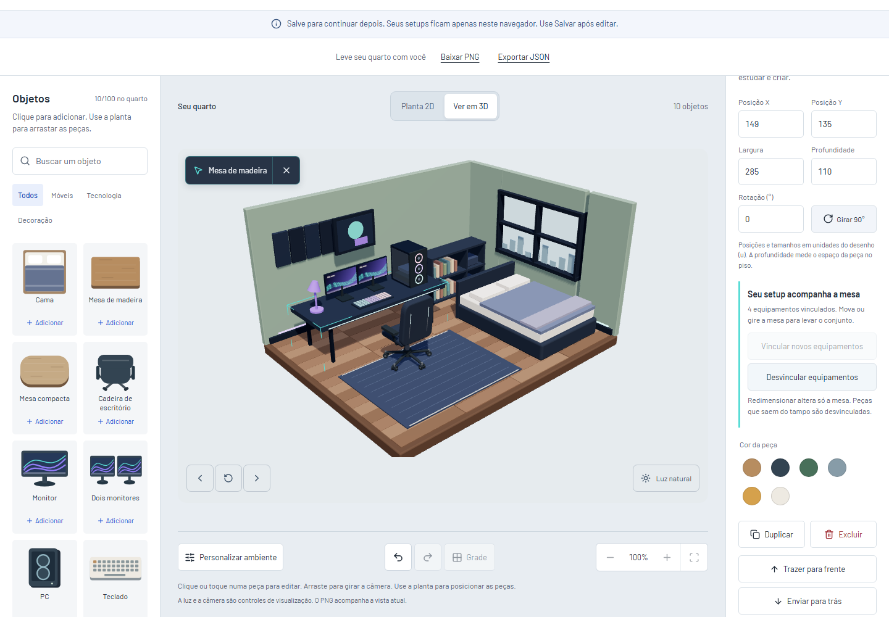
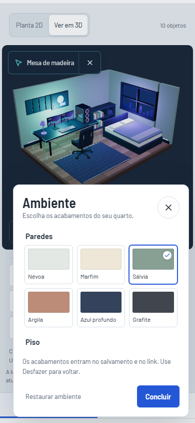

# Terceira entrega da revisão: agrupamento e ambiente

Esta etapa permite reorganizar uma bancada inteira e escolher os acabamentos do quarto. As duas funções participam do histórico, do salvamento local, do backup JSON e dos links compartilhados.

## Experimentar

1. Abra o quarto gamer e selecione a mesa, pelo 3D ou pela lista.
2. Nas propriedades, ative **Mover com equipamentos**. O exemplo vincula dois monitores, PC, teclado e luminária.
3. Na planta, arraste a mesa ou altere sua posição. Gire para observar os equipamentos acompanhando sua orientação.
4. Use **Desfazer**. O conjunto volta em uma única ação, mesmo após um arrasto longo.
5. Abra **Personalizar ambiente**, escolha uma tinta e um piso, e clique em **Concluir**.
6. Alterne entre planta e 3D. Salve, recarregue e compartilhe com outra sessão.

## Como o agrupamento funciona

Uma peça recebe o campo opcional `attachedTo`, que aponta para o ID da mesa. As coordenadas continuam no espaço do desenho. O documento não guarda grupos gráficos do Three.js ou elementos SVG.

[`surfaces.ts`](../src/features/editor/surfaces.ts) reúne a detecção de apoio usada pelo agrupamento e pelo 3D. Monitor, dois monitores, PC, teclado, luminária e planta podem ser vinculados. O centro da peça precisa estar sobre o tampo, considerando a rotação da mesa. Em mesas sobrepostas, o vínculo existente tem preferência; peças soltas seguem a mesma escolha de apoio da projeção.

[`grouping.ts`](../src/features/editor/grouping.ts) transforma o vetor entre o centro da mesa e cada equipamento e soma a mudança de ângulo à rotação de cada peça. Depois calcula os limites de todos os membros e mantém o conjunto inteiro dentro do quarto. Uma rotação que não cabe é recusada, com mensagem, preservando tamanhos e histórico.

O arrasto usa sempre a composição do início do gesto. Isso evita acumular deslocamentos nos equipamentos a cada evento do ponteiro. Confirmar cria uma entrada de histórico; cancelar restaura todas as peças.

Regras da interface:

- Vincular é explícito. Setups antigos continuam com peças independentes até essa escolha.
- Novos equipamentos sobre uma mesa já agrupada podem ser vinculados pelo painel.
- Um equipamento pode ser ajustado sozinho. Ao sair do tampo, perde o vínculo.
- Redimensionar altera apenas a mesa. Equipamentos preservam tamanho e posição; os que deixam o tampo são desvinculados.
- Excluir a mesa preserva os equipamentos e libera os vínculos. Desfazer recupera a mesa e seus vínculos.
- Duplicar nas propriedades copia somente a peça selecionada, sem outro conjunto ou vínculo.
- O agrupamento mantém a disposição, mas permite sobreposições e não valida colisões.

## Acabamentos e direção visual

O painel mantém Barlow e Barlow Semi Condensed, texto alinhado à esquerda, branco `#ffffff`, texto `#202b38`, área de trabalho `#e8edf2`, ação azul `#2457d6` e detalhe ciano `#59dcd6`. Amostras representam tintas e materiais, para comparar a escolha no quarto.

A revisão do plano visual retirou a ideia de adicionar outro painel permanente ao editor. No desktop, o diálogo ocupa a lateral; no celular, abre na parte inferior, com rolagem própria. Foco, Escape e isolamento dos atalhos seguem o padrão dos outros diálogos. A entrada tem animação curta, desativada com movimento reduzido.

Na revisão com a skill `frontend-design-references`, o [painel inferior do Recollect no 60fps](https://60fps.design/shots/recollect-pro-bottom-sheet-to-page-interaction) serviu como referência de composição: o estado compacto mantém a tela de origem visível e organiza a ação principal no rodapé. Foram inspecionados os frames do vídeo. A adaptação ao RoomLab preserva a vista do quarto acima do painel no celular, limita sua altura e mantém Fechar e Concluir acessíveis durante a rolagem das amostras. A expansão para uma página inteira e o conteúdo promocional da referência não foram incorporados.

[`appearance.ts`](../src/features/editor/appearance.ts) define seis tintas e quatro pisos: carvalho, madeira cinza, nogueira e pedra clara. Madeira usa réguas; pedra usa placas. Cor e rugosidade variam no 3D; na planta, o acabamento aparece no padrão do piso e nas paredes.

Os materiais usam as propriedades de [MeshStandardMaterial do Three.js](https://threejs.org/docs/pages/MeshStandardMaterial.html). Os acabamentos são estilizados e não representam produtos de uma loja ou simulação fotográfica.

Luz e câmera continuam como preferências temporárias. Tinta e piso fazem parte da composição salva. Restaurar o ambiente recupera os acabamentos do exemplo inicial e pode ser desfeito.

## Estado e compatibilidade

O histórico passou a guardar snapshots com `objects` e `appearance`. Escolher novamente o acabamento ativo não cria uma ação nem apaga o futuro.

`appearance` e `attachedTo` são opcionais nos documentos da versão 1. Quando os acabamentos estão ausentes, o editor usa os valores originais do ambiente de partida. Backups e links anteriores continuam abrindo sem uma migração destrutiva.

O parser valida cores, pisos conhecidos e referências: apenas equipamentos podem apontar para uma mesa existente. Não admite cadeias, ciclos ou referências ausentes. Campos desconhecidos são descartados. Dados inválidos continuam preservados pelas regras anteriores de armazenamento.

O estado de alterações pendentes considera os acabamentos. PNG, previews da biblioteca e o visualizador compartilhado recebem a mesma configuração. Salvar uma cópia ou importar JSON preserva os vínculos internos.

Também foi corrigida a troca indevida do ambiente após salvar: atualizar o endereço não deve transformar um workspace gamer em estudo. O contexto fica estável até abrir outra composição.

## Verificação

Esta entrega aprovou **37 testes unitários, 97 casos de navegador e 4 casos de Pages**. Onze casos são ignorados em perfis aos quais não se aplicam. Os checks de tipos, lint, formatação e build também passaram.

Os testes cobrem transformações do conjunto, limites, cancelamento, histórico, desvinculação, materiais, documentos anteriores, referências inválidas, salvamento, backup, compartilhamento independente e cópia editável. O fluxo de Pages verifica essas informações no build sob `/RoomLab/`.

As capturas podem ser reproduzidas com `node scripts/capture-composition.mjs`, usando a porta 5174 ou `ROOMLAB_PREVIEW_URL`. Os perfis usam Chromium; o teste de toque envia eventos pelo protocolo do navegador. Isso não equivale a aparelhos físicos.

## Para aprender e explicar

1. Acompanhe uma ação `attach` do botão até o reducer. Compare o documento antes e depois.
2. Em `grouping.ts`, desenhe o vetor mesa/equipamento e explique uma rotação de 90 graus.
3. Compare um preview de arrasto com um update de posição. Por que precisam da mesma regra?
4. Adicione uma tinta em `wallPaints` e verifique o quarto nas duas vistas.
5. Exporte JSON e identifique o que persiste e o que é apenas preferência de visualização.
6. Abra um backup anterior sem `appearance` e explique como os padrões preservam o quarto.

Esta entrega encerra as três etapas propostas na revisão. Otimização de cenas maiores, novos acessórios, recuperação automática de rascunhos e arrasto diretamente no 3D continuam como possibilidades futuras.
