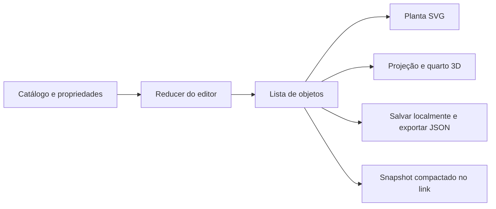

# Arquitetura do RoomLab

O RoomLab é uma aplicação front-end hospedada no GitHub Pages. O navegador mantém o documento do quarto, administra a edição e desenha suas representações. Não existe um servidor de aplicação.

## Documento único, duas representações

Cada objeto tem `id`, `kind`, `x`, `y`, `w`, `h`, `color` e `rotation`. A ordem da lista determina as camadas da planta. O modelo não salva coordenadas em pixels da tela, elementos DOM ou instâncias do Three.js.



O documento salvo acrescenta nome, ambiente de partida, datas e revisão. Seleção, zoom, grade, câmera e iluminação de visualização ficam fora da persistência. O histórico de edição também não é salvo.

## Organização

```text
src/
  pages/                  Home, editor, biblioteca e visualizador compartilhado
  components/             Marca e diálogos reutilizados
  features/
    catalog/              Dados e ilustrações das peças
    editor/               Reducer, geometria, planta e propriedades
    room3d/               Projeção, modelos e ciclo de renderização
    setups/               Biblioteca local, salvamento e importação/exportação
    sharing/              Documento público, codec e diálogo de compartilhamento
  main.tsx                Inicialização e escolha do roteador
  styles.css              Interface de edição e componentes comuns
  studio.css              Estúdio, controles 3D e animações
tests/                    Regras puras e fluxos de navegador
scripts/                  Capturas, build de Pages e verificação pública
```

## Edição, coordenadas e histórico

[`useRoomEditor`](../src/features/editor/useRoomEditor.ts) reúne o reducer e as ações usadas pela interface. [`editorModel.ts`](../src/features/editor/editorModel.ts) mantém objetos atuais, passado, futuro e o início de um gesto.

Durante um arrasto, ações de preview atualizam a representação. Ao concluir, o gesto gera uma entrada no histórico; ao cancelar, o estado inicial é restaurado. Uma nova edição limpa o futuro. O histórico guarda até 50 ações.

[`RoomScene.tsx`](../src/features/editor/RoomScene.tsx) transforma as coordenadas do ponteiro para o espaço do SVG com a matriz inversa da tela. Isso permite que o movimento acompanhe o cursor mesmo com zoom ou layout responsivo. Pointer capture mantém o gesto ao sair da peça. Mouse, toque e teclado usam as mesmas regras geométricas.

[`geometry.ts`](../src/features/editor/geometry.ts) calcula limites por tipo, dimensões após rotação, posição dentro do quarto e alinhamento à grade. Essas funções não dependem de React ou do DOM e são verificadas por testes unitários.

## Navegação, foco e telas compactas

[`SectionLink.tsx`](../src/components/SectionLink.tsx) gera endereços pelo roteador e, na ativação normal de um link dentro da página, faz rolagem e foco sem alterar a rota. Isso preserva o rascunho do editor e o fragmento de dados dos snapshots. Os destinos recebem `tabIndex={-1}`. Links abertos com modificadores continuam usando o endereço gerado para o modo de roteamento atual.

O manipulador de atalhos do editor ignora eventos já tratados, campos de entrada, gestos em andamento e diálogos nativos abertos. Os diálogos mantêm seus próprios controles de teclado e retorno de foco.

Até 900 pixels de largura, adicionar uma peça, selecionar pelo teclado ou abrir Propriedades ativa um painel inferior com rolagem própria. A vista usa a altura disponível acima do painel. Seleção pelo ponteiro preserva o layout existente durante o gesto, para não alterar a transformação de coordenadas. Abrir Catálogo devolve o painel ao fluxo e leva a lista de peças à vista. Veja o [registro da revisão de UX](CORRECOES-UX.md) e os testes de [interação compacta](../tests/touch.spec.ts).

## Representação 3D

[`projection.ts`](../src/features/room3d/projection.ts) converte o centro da peça para X/Z no piso e a rotação para o eixo vertical. Equipamentos recebem altura de bancada quando seu centro está sobre uma mesa, considerando a rotação da mesa. O tapete também funciona como uma superfície de apoio; quando a mesa está sobre ele, seus equipamentos acompanham a mesma elevação.

[`models.ts`](../src/features/room3d/models.ts) constrói mobiliário com geometria, materiais, texturas de tela e detalhes por categoria. As proporções são estilizadas: telas preservam 16:9, cadeira e equipamentos acompanham o tamanho da peça, e a mesa mantém uma altura de apoio comum. O ambiente gamer acrescenta materiais escuros e iluminação RGB.

[`chair.ts`](../src/features/room3d/chair.ts) reúne assento, encosto, pistão e cinco braços com rodízios duplos. [`primitives.ts`](../src/features/room3d/primitives.ts) posiciona estruturas por pontos de conexão e constrói tampos arredondados. Os testes de [mobiliário](../tests/furniture.test.ts) verificam o encaixe da base nos rodízios, o eixo das rodas, limites após redimensionamento e altura do tampo.

[`RoomCanvas.tsx`](../src/features/room3d/RoomCanvas.tsx) administra renderer, luzes, câmera e OrbitControls. O motor é carregado por importação dinâmica. Renderizações são solicitadas por mudanças relevantes, e a câmera usa uma animação curta em resposta aos controles. O limite de densidade é 1,7 pixels por pixel CSS. Geometrias, materiais, texturas e controles são liberados ao desmontar.

[`RoomPreview.tsx`](../src/features/room3d/RoomPreview.tsx) apresenta carregamento, ações acessíveis e alternativa em planta se WebGL não estiver disponível. A lista e as propriedades permanecem em HTML, porque uma imagem 3D não substitui controles acessíveis.

## Persistência e falhas

[`storage.ts`](../src/features/setups/storage.ts) acessa `localStorage` por uma interface pequena. O documento utiliza a versão 1 e passa por validação: estrutura, tipos conhecidos, números finitos, cores, IDs únicos, datas e limites. Campos desconhecidos não são reconstruídos no documento validado.

Dados inválidos não são silenciosamente substituídos por uma biblioteca vazia. Bloqueios de acesso e quota insuficiente geram mensagens e preservam a composição aberta. O editor avisa ao sair com alterações pendentes.

Uma revisão identifica cada versão salva. Operações com uma revisão desatualizada detectam alterações já gravadas em outra aba. Essa comparação não é uma transação atômica: escritas exatamente simultâneas ainda podem disputar o armazenamento. O projeto não implementa edição colaborativa.

## Compartilhamento estático

[`document.ts`](../src/features/sharing/document.ts) define a cópia pública: versão, nome, ambiente e objetos. Metadados da biblioteca, revisão, seleção e histórico não são incluídos.

[`codec.ts`](../src/features/sharing/codec.ts) valida, serializa, compacta com gzip e codifica em base64url. No Pages, o conteúdo fica após `#`, em `/RoomLab/#/setup?data=v1...`. O navegador recebe o arquivo estático e decodifica o documento localmente. A requisição HTTP inicial não inclui o fragmento do endereço.

O token é limitado a 12.000 caracteres, e a leitura descompactada é limitada a 64.000 bytes. Entradas inválidas, versões incompatíveis e navegadores sem as APIs de compressão recebem uma alternativa ou mensagem de recuperação. O endereço não é criptografado: qualquer pessoa com o link completo pode ler o nome e a composição. Ele não oferece expiração ou revogação centralizada.

O visualizador permite salvar uma cópia com nova identidade local. Alterar essa cópia não modifica o snapshot original.

## Exportação e publicação

JSON exporta um documento validável e permite importação como nova cópia. O limite de importação é 200.000 bytes. PNG em planta usa uma cópia do SVG sem seleção; PNG em 3D solicita uma renderização e copia os pixels antes de o navegador limpar o buffer gráfico.

Em desenvolvimento, as rotas utilizam caminhos normais. O build de Pages usa `VITE_BASE_PATH=/RoomLab/` e `VITE_ROUTER_MODE=hash` para recarregar rotas sem um servidor de aplicação. O workflow valida o código antes de publicar o diretório `dist`.

## Limites e próximos pontos de evolução

| Decisão atual | Limite | Possível evolução |
| --- | --- | --- |
| Armazenamento local e manual | Não sincroniza dispositivos; dados podem ser removidos pelo navegador | Sincronização opcional, com autenticação e migração de documentos |
| Snapshot dentro da URL | Link longo, fixo e sem revogação | Serviço opcional de links curtos |
| Geometria estilizada e alturas por tipo | Não fornece medidas de compra ou validação arquitetônica | Dimensões físicas e modelos com dados reais |
| Posição em planta e preview 3D | Não há arrasto direto de móveis no 3D; sobreposições são permitidas | Manipulação 3D e regras explícitas de colisão/suporte |
| Reconstrução dos modelos ao editar | Cenas maiores podem exigir otimização | Medir em dispositivos reais e considerar instanciamento/cache |
| Testes de Chromium em perfis responsivos | Não cobre todos os motores e aparelhos | Testes em Firefox, WebKit e dispositivos físicos |

As evoluções são possibilidades, não funcionalidades entregues ou compromissos de prazo. Não há promessa de 60 fps, conformidade certificada de acessibilidade ou uso em produção sem medições correspondentes.
