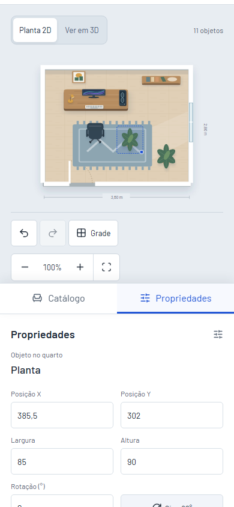
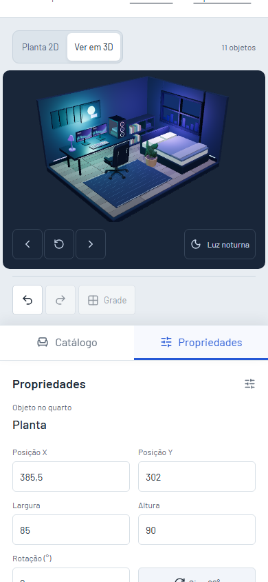

# Primeira entrega da revisão de UX

Esta etapa corrige navegação, atalhos durante diálogos e edição em telas compactas. Ela parte da revisão feita depois do refinamento dos modelos 3D.

## Problemas e resultados

| Antes | Depois |
| --- | --- |
| No Pages, `#examples` e `#main-content` eram interpretados como rotas desconhecidas. | Os links levam à seção e transferem o foco, preservando o endereço, o documento compartilhado e o rascunho aberto. |
| Delete, duplicação, movimento e histórico chegavam ao editor enquanto um diálogo estava aberto. | Os atalhos do quarto ficam suspensos durante os diálogos de compartilhamento e confirmação de saída. Escape e os controles do diálogo continuam disponíveis. |
| Adicionar uma peça no celular levava a página até as propriedades e tirava o quarto da vista. | Propriedades e abas ocupam um painel inferior. A planta ou o 3D permanecem acima; o conteúdo do painel tem sua própria rolagem. |

[Ver a edição no tablet](screenshots/compact-tablet.png).

## Como funciona

[`SectionLink.tsx`](../src/components/SectionLink.tsx) usa o roteador para gerar um endereço válido nos dois modos de navegação. Na ativação normal, encontra a seção, faz a rolagem e transfere o foco com `preventScroll`. Essa ação dentro da página não cria uma nova entrada de rota, por isso não dispara o aviso de saída de um rascunho. No modo de caminhos normais, o fragmento `#data=` dos links compartilhados também é preservado. Os destinos têm `tabIndex={-1}` para receber foco sem virar novas paradas na sequência de Tab.

Em [`Editor.tsx`](../src/pages/Editor.tsx), o manipulador de teclado verifica `dialog[open]` antes de executar atalhos. Isso consulta o estado real dos diálogos nativos e evita manter uma segunda variável para representar a mesma informação. Eventos já tratados e campos de texto continuam protegidos.

O painel compacto é ativado ao adicionar ou selecionar uma peça pelo teclado, ou ao abrir a aba Propriedades. A página volta até o quarto e o título do painel recebe foco sem provocar outra rolagem. Ao abrir o Catálogo, o painel volta ao fluxo da página e a lista de peças fica à vista.

O começo de um arrasto exige outro cuidado: a seleção pelo ponteiro preserva o layout atual, o tamanho da planta e a rolagem. Mudar a escala do SVG nesse momento altera a conversão entre coordenadas de tela e coordenadas do documento. Os testes existentes de movimento com zoom e redimensionamento verificam esse contrato.

As regras em [`styles.css`](../src/styles.css) e [`studio.css`](../src/studio.css) limitam o painel pela altura da janela, reduzem o espaço da vista e deixam os campos acessíveis por rolagem interna. A ilustração grande da peça e as instruções repetidas são ocultadas durante a edição compacta. Os controles de zoom, que não operam no 3D, também são ocultados nessa combinação. O documento salvo e compartilhado mantém a versão 1.

## Validação

- Lint, formatação, tipos e build aprovados.
- 26 testes unitários aprovados.
- 80 casos de navegador aprovados, com sete casos ignorados em perfis onde não se aplicam.
- Quatro casos do build de Pages aprovados, incluindo âncoras, foco e rascunho preservado.
- Capturas revisadas em 320×780, 390×844, 768×1024 e 844×390, incluindo o 3D gamer no celular.

[`dialog-shortcuts.spec.ts`](../tests/dialog-shortcuts.spec.ts) verifica a composição e o histórico enquanto os diálogos estão abertos. [`touch.spec.ts`](../tests/touch.spec.ts) verifica a posição da planta e do preview 3D acima do painel, edição de campos, cores e retorno ao catálogo. [`pages.spec.ts`](../tests/pages.spec.ts) cobre os links no build com base `/RoomLab/`. [`sharing.spec.ts`](../tests/sharing.spec.ts) confirma que pular para o conteúdo não altera o endereço do snapshot.

Os perfis usam Chromium. Teclado virtual, barras móveis do navegador e aparelhos físicos ainda precisam de verificação própria. O build continua avisando sobre o tamanho do módulo 3D, carregado separadamente.

## Para aprender com esta entrega

1. Abra a demo no desktop, pressione Tab e Enter no link de pular para o conteúdo. Observe o foco e compare o endereço antes e depois.
2. Edite um quarto, abra Compartilhar e pressione Delete ou Ctrl+D. Feche com Escape e confira que as peças e o histórico continuam iguais.
3. No celular, adicione uma planta, altere a largura e a cor, role apenas o painel e volte ao Catálogo. Repita no quarto gamer.
4. Leia `showProperties` e explique por que uma seleção durante o arrasto não pode mudar o layout. Depois acompanhe `getScreenCTM` em `RoomScene.tsx` para conectar essa decisão à geometria.

Seleção direta no 3D, agrupamento de equipamentos com a mesa e dimensões físicas são possibilidades de outras entregas. Esta etapa resolve os problemas de interação identificados na revisão.
