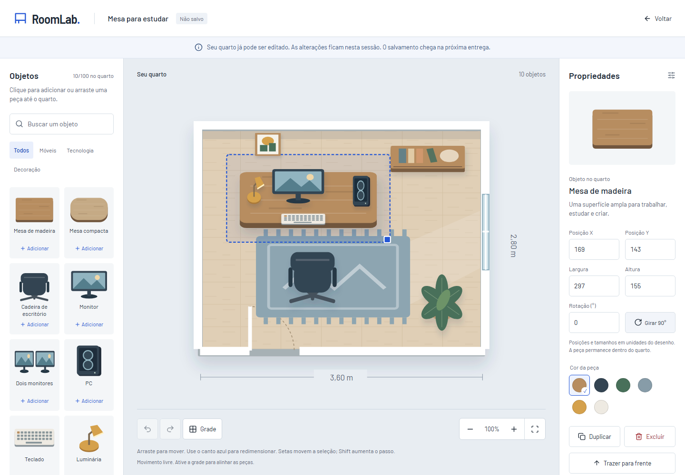

# Segunda entrega: editor funcional

## O que foi entregue

Adicionar peças por clique/toque ou arrasto do catálogo no desktop; selecionar; mover; girar; redimensionar; trocar cores; duplicar; excluir; ordenar camadas; alinhar movimento à grade; ajustar zoom; desfazer e refazer. As peças respeitam os limites do quarto, inclusive depois de girar.

O estado fica em memória. Sair do editor ou recarregar descarta as edições. Não existe indicador de salvamento concluído ou botão de compartilhamento nesta etapa.

## Como experimentar

1. Abra `/editor?scene=empty` e adicione uma mesa.
2. Use o catálogo para acrescentar monitor, cadeira e planta.
3. Arraste uma peça pelo quarto. Solte fora da área para conferir que ela permanece dentro dos limites e o gesto termina normalmente.
4. Mude a rotação pelos controles e use o canto azul ou os campos de largura/altura para redimensionar.
5. Troque a cor, duplique uma peça e teste a ordem das camadas.
6. Desfaça e refaça. Cada arrasto completo ocupa apenas uma ação no histórico.
7. Ative a grade, mova uma peça e aumente o zoom. Zoom e grade não entram no histórico do quarto.
8. No celular, toque no catálogo para adicionar e mova as peças diretamente com o dedo. Os campos são uma alternativa às alças pequenas do desenho.

## Atalhos

| Ação | Atalho |
| --- | --- |
| Mover seleção | Setas; Shift aumenta o passo de 2 para 10 unidades |
| Duplicar | Ctrl/Cmd + D |
| Excluir | Delete ou Backspace |
| Desfazer | Ctrl/Cmd + Z |
| Refazer | Ctrl/Cmd + Shift + Z ou Ctrl/Cmd + Y |
| Cancelar arrasto | Escape enquanto o gesto está ativo |
| Limpar seleção | Escape fora de um gesto |
| Confirmar um campo | Enter ou sair do campo |
| Cancelar edição de campo | Escape |

Atalhos do editor não interferem com campos de texto/número. A seleção também funciona pela lista de objetos, sem exigir apontar para o SVG.

## O que aprender

### Documento e estado de interface

`useRoomEditor.ts` conecta os controles ao modelo. O array de objetos representa o quarto. Busca, aba aberta, zoom e seleção são estados separados porque não alteram a composição. Esta é a base para salvar somente o documento na próxima entrega.

### Reducer e histórico

`editorModel.ts` recebe ações e devolve um novo estado sem alterar os arrays anteriores. `past` contém até 50 versões anteriores; `future` permite refazer. Uma edição nova limpa o futuro. A cena admite até 100 objetos.

Um gesto tem três fases: `begin` guarda o ponto de partida, `preview` atualiza o desenho e `end` registra uma mudança no histórico. `cancel` restaura o início. Um clique sem movimento não cria uma ação vazia.

Exercício: siga uma duplicação pelo código e explique por que ela deve limpar o histórico de refazer depois de um desfazer.

### Ponteiro e zoom

`RoomScene.tsx` converte as coordenadas da tela para o espaço do SVG usando a inversa de `getScreenCTM()`. Assim, mover 40 unidades continua sendo mover 40 unidades quando o zoom muda. O ponteiro é capturado na própria peça para continuar recebendo eventos quando sai da área.

Referências consultadas: [conversão de coordenadas SVG](https://developer.mozilla.org/en-US/docs/Web/API/SVGGraphicsElement/getScreenCTM), [captura do ponteiro](https://developer.mozilla.org/en-US/docs/Web/API/Element/setPointerCapture) e [useReducer](https://react.dev/reference/react/useReducer).

### Geometria de objetos girados

`geometry.ts` calcula o retângulo externo de uma peça girada a partir da largura, altura e ângulo. O centro é limitado de forma que todo esse retângulo caiba no quarto. Tamanhos mínimos e máximos variam por tipo de objeto.

O redimensionamento converte o deslocamento do ponteiro para os eixos locais da peça. Isso evita tratar um objeto girado como se seus eixos ainda fossem os da tela. A grade usa a origem do quarto e intervalos de 10 unidades; ela afeta o movimento por arrasto.

Exercício: gire uma mesa em 45°, leve-a até uma parede e compare o resultado com uma mesa sem rotação. Encontre no código onde o tamanho externo muda.

### Valores temporários nos campos

`ObjectProperties.tsx` mantém o texto que está sendo digitado separado do valor confirmado. Enter ou blur confirma, Escape cancela, campo vazio restaura o valor anterior. Limites são aplicados no modelo; digitar um tamanho excessivo não coloca um valor inválido no documento.

### Escolha do motor de desenho

Foi mantido o SVG nativo. A composição já estava pronta e os testes confirmaram captura, transformações e conversão de coordenadas com zoom. Konva e Zustand não foram adicionados: `useReducer` e SVG atendem ao escopo atual. Essa decisão reduz dependências e mantém a lógica de geometria independente de um motor específico.

## Correções encontradas na validação

- A mensagem da cena vazia interceptava o drop. O conteúdo informativo agora permite que os eventos alcancem o quarto; seu botão continua clicável.
- Após um arrasto por toque, Chromium nem sempre gerava o clique da primeira aba tocada. As abas também respondem ao `pointerup` de toque, com a mesma ação idempotente. Mouse e teclado continuam usando clique.
- Valores temporários nos campos eram restaurados incorretamente ao cancelar ou atingir um limite. A confirmação agora diferencia rascunho, valor confirmado e cancelamento.
- Títulos públicos da aplicação passaram a usar separadores sem travessão, conforme a preferência do autor.

## Verificação

- Build, TypeScript, lint e formatação aprovados.
- 6 testes unitários de geometria, tamanho, dados não finitos, histórico e limite da cena.
- 30 testes Playwright aprovados em Chromium, com perfis desktop, tablet e mobile.
- 6 combinações de perfil não aplicáveis são ignoradas: testes de toque rodam no perfil mobile e drop HTML do catálogo no desktop.
- Validados movimento com zoom, gesto único no histórico, Escape, resize, cor, exclusão, camadas, grade, toque após arrasto e uma cena com 20 objetos.
- Capturas de desktop e celular revisadas; layout estreito em 320 px segue sem rolagem horizontal nos testes.

Não há declaração de desempenho em fps. Uma cena de 20 objetos foi usada para verificar o fluxo, sem benchmark. Safari, Firefox e aparelhos físicos ainda precisam de validação própria.

## Limitações atuais e próximo passo

As peças são ilustrações 2D, não volumes 3D ou medidas arquitetônicas calibradas. Podem se sobrepor; o usuário controla a ordem das camadas. Mover a mesa não move automaticamente o monitor ou teclado. Quadros e prateleiras não possuem ancoragem física às paredes nesta versão. Zoom vai de 80% a 130%, sem navegação por pan ou gesto de pinça.

A próxima entrega é persistência local: nomear, salvar automaticamente, reabrir, listar configurações e exportar. O compartilhamento público permanece como uma etapa posterior.
