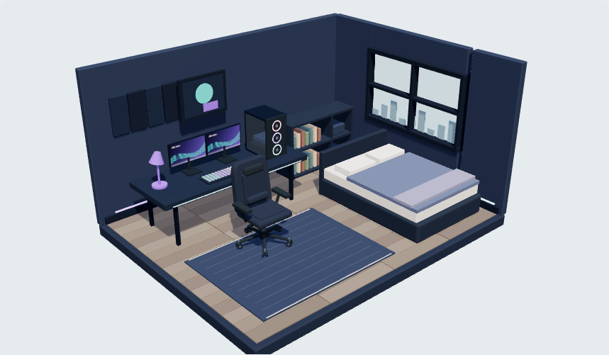

# Refinamento do mobiliário

Revisão visual de 6 de outubro de 2026. O foco é a construção das peças e sua relação dentro do quarto.

## Direção antes da implementação

A identidade continua concentrada no quarto. A interface mantém Barlow para leitura e Barlow Semi Condensed para marca e títulos, com texto alinhado à esquerda.

| Material | Cor | Uso |
| --- | --- | --- |
| Grafite | `#25313b` | Estrutura e braços da cadeira |
| Metal | `#59606a` | Pistão, cubo e eixos |
| Tecido | Cor escolhida para a peça | Assento e encosto |
| Madeira | `#b78d60` | Mesa e estante |
| LED | `#59dcd6` | Pequeno detalhe do modelo gamer |
| Bancada | `#e8edf2` | Interface existente |

Comparação das alternativas:

```text
A: detalhes sobre o modelo atual     B: reconstrução das conexões (escolhida)
   encosto retangular                  encosto inclinado e estofado
   assento                              assento + suporte dos braços
   base solta + rodas                   pistão > cubo > cinco braços > rodízios
```

Adicionar detalhes à base antiga esconderia o problema de construção. A revisão usa conexões contínuas, rodas orientadas pelo eixo correto e proporções que acompanham o tamanho da peça. O LED fica discreto; o formato da cadeira precisa funcionar também com luz natural.

Monitores terão telas com proporção 16:9, estantes terão vãos abertos e os tamanhos iniciais de equipamentos serão revistos junto dos exemplos. O preview continua estilizado, sem compromisso de medidas físicas para comprar móveis.

## Compatibilidade

Os documentos continuam na versão 1. Tamanhos e posições de composições salvas são preservados; a representação do mobiliário muda. Novos exemplos e novas peças recebem os tamanhos iniciais revisados.

## Verificação

Foram revisados o quarto gamer à noite, o ambiente com luz natural, a cadeira vista de frente e o editor em desktop e celular. As capturas não registraram erros de execução nem rolagem horizontal indevida.



O modelo agora tem braços contínuos até os rodízios, eixos horizontais e encosto estofado inclinado. Monitores preservam 16:9 ao redimensionar. A estante tem nichos com livros apoiados nas divisórias, a mesa compacta tem cantos arredondados na planta do tampo e o gabinete tem estrutura aberta sob o vidro lateral.

Os testes geométricos verificam limites da cadeira, conexão dos rodízios, eixo das rodas, pontos de fixação das estruturas, altura do tampo, apoio sobre tapetes girados e preservação das dimensões dos documentos anteriores.

Validação local: 26 testes unitários, 72 casos de navegador e 2 casos do build de Pages aprovados. Seis casos de navegador são ignorados nos perfis em que não se aplicam. Lint, formatação, checagem de tipos e build também aprovados. A suíte usa Chromium em perfis responsivos, sem certificação em aparelhos físicos.

O módulo 3D continua sendo carregado separadamente. O build mantém o aviso sobre seu tamanho; este refinamento não acrescenta dependências.

## Para aprender no código

- Em [chair.ts](../src/features/room3d/chair.ts), siga o caminho do cubo central até o rodízio. Cada braço usa dois pontos de fixação e cada roda gira sobre um eixo horizontal.
- Em [primitives.ts](../src/features/room3d/primitives.ts), `strut` orienta um cilindro entre dois pontos. Isso evita deslocar a geometria para fora do pivô e gerar braços desconectados ao girar.
- Em [projection.ts](../src/features/room3d/projection.ts), compare a elevação da mesa com a dos equipamentos. Se o tapete levanta a mesa, a bancada também sobe.
- Em [furniture.test.ts](../tests/furniture.test.ts), experimente remover a rotação das rodas ou deslocar a ponta do braço. Os testes verificam propriedades mecânicas do modelo.

As quebras de linha de arquivos de texto são padronizadas em LF por `.gitattributes`, para que a verificação de formatação seja consistente entre Windows e o CI.
