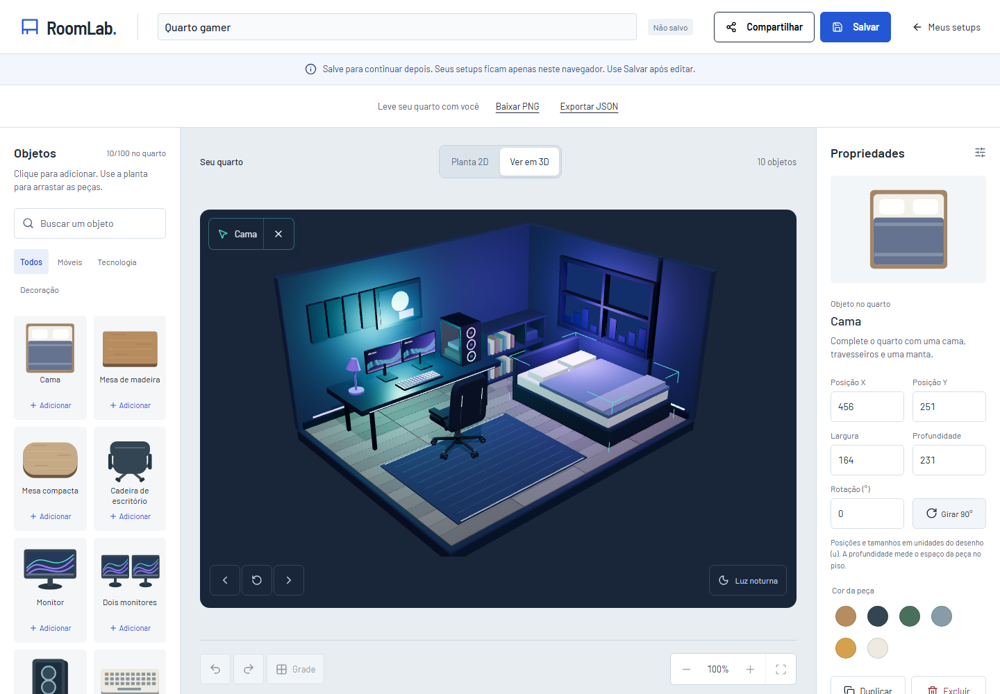
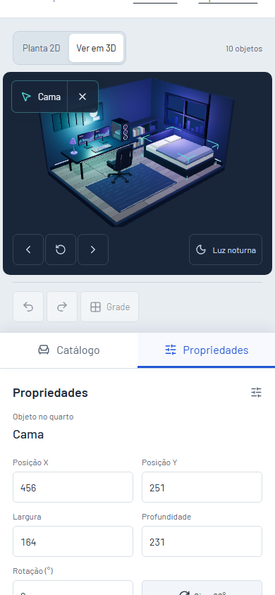

# Segunda entrega da revisão: seleção no 3D

## Direção da interação

O quarto é o centro da edição. Clicar ou tocar numa peça deve identificá-la, destacar seu volume e abrir as mesmas propriedades usadas pela planta e pela lista. Arrastar continua girando a câmera.

- Cores: base do estúdio `#e6edf2`, fundo gamer `#192639`, texto claro `#f4f7fb`, seleção `#59dcd6` e ação `#2459ff`.
- Tipografia: Barlow nos controles e Barlow Semi Condensed na marca, preservando a identidade existente.
- Layout: uma indicação curta no canto da vista, com nome da peça e ação de limpar a seleção. Propriedades continuam à direita no desktop e no painel inferior em telas compactas.
- Feedback: cantos finos delimitam o volume selecionado; o cursor identifica peças clicáveis. O quarto e os materiais permanecem legíveis.

```text
Vista 3D                         Propriedades
[ Cadeira               × ]     Cadeira
                                Posição, tamanho, cor
         quarto                 Duplicar / excluir

       câmera / iluminação
```

A revisão do desenho preferiu cantos ao redor da peça a uma caixa completa ou mudança de sua cor. Esse destaque informa qual volume será editado sem confundir a seleção com a cor escolhida para o móvel. A indicação só aparece no editor; home e links compartilhados continuam oferecendo exploração da câmera.





[Ver a seleção no tablet](screenshots/selection-tablet.png).

## Comportamento entregue

- Clique ou toque numa peça do 3D abre suas propriedades e sincroniza a seleção com a lista e a planta.
- O volume recebe cantos de destaque; o nome aparece na vista com o botão Limpar seleção. Clicar no fundo ou pressionar Escape com foco no canvas também limpa a seleção.
- Arrastos giram a câmera e preservam a seleção. Dois dedos, pressão prolongada e gestos cancelados não selecionam peças.
- Cores, tamanhos, duplicação, exclusão e histórico continuam usando as ações existentes do editor.
- O PNG inclui o quarto e a câmera atuais, sem o destaque da seleção.
- O campo Profundidade descreve o espaço da peça no piso. As cotas da planta usam 522 u e 410 u, vindos da geometria do documento, substituindo medidas fixas em metros que não correspondiam ao modelo.

## Decisões no código

[`selection.ts`](../src/features/room3d/selection.ts) usa o [Raycaster do Three.js](https://threejs.org/docs/pages/Raycaster.html) para procurar a primeira interseção. A leitura inclui paredes e piso: filtrar apenas móveis permitiria selecionar peças escondidas pela arquitetura. A identificação sobe dos detalhes do modelo até o grupo que contém o ID do objeto do documento.

O destaque usa uma geometria pequena e reutilizável, separada dos modelos do quarto. Mudar a seleção atualiza esse destaque sem reconstruir os móveis nem reiniciar a câmera. Transformar a peça recalcula seu volume. A geometria e o material do destaque são liberados ao sair da vista.

[`RoomCanvas.tsx`](../src/features/room3d/RoomCanvas.tsx) acumula a distância percorrida pelo ponteiro. Até seis pixels e menos de 700 ms, com um ponteiro e a mesma peça no começo e no fim, formam um candidato a seleção. Voltar ao ponto inicial depois de arrastar continua sendo um gesto de câmera. A confirmação acontece no evento de clique, depois dos eventos de mouse sintetizados pelo toque, para que o foco permaneça no painel de propriedades.

O callback de seleção recebe o estado atual por `useEffectEvent`, sem reinstalar o motor a cada renderização do React. [`RoomPreview.tsx`](../src/features/room3d/RoomPreview.tsx) apresenta o nome e a ação em HTML; [`Editor.tsx`](../src/pages/Editor.tsx) conecta o ID à seleção existente. A lista continua sendo a alternativa para selecionar pelo teclado ou acessar objetos escondidos.

Ao exportar, o evento de snapshot oculta o destaque, renderiza e copia os pixels. A vista volta a desenhar a seleção no quadro seguinte. O nome da peça é HTML fora do canvas e também não entra no PNG.

## Verificação

- Lint, formatação, tipos e build aprovados.
- 30 testes unitários aprovados.
- 87 casos de navegador aprovados; nove casos ignorados nos perfis em que não se aplicam.
- Quatro casos do build de Pages aprovados, com seleção, cor, salvamento, compartilhamento e cópia editável.
- Capturas do desktop, celular e tablet revisadas.

[`selection.test.ts`](../tests/selection.test.ts) cobre detalhes aninhados, transformações, oclusão por paredes, limites do destaque e classificação de gestos. [`selection.spec.ts`](../tests/selection.spec.ts) usa cliques reais e eventos de toque do Chromium, incluindo vários dedos e cancelamento. O teste de exportação compara os pixels do PNG com o quarto após limpar a seleção. Os testes existentes continuam verificando edição, dados, gestos, diálogos e rotas.

## Para aprender com a entrega

1. Abra o quarto gamer e clique na cama. Troque a cor, mude para a planta e confira a mesma peça selecionada. Desfaça e refaça a mudança.
2. Arraste a câmera começando sobre um móvel. Compare esse gesto com um clique parado e explique por que o editor precisa distinguir os dois.
3. Selecione uma peça e baixe PNG. Compare o arquivo com a vista: o destaque ajuda a editar, mas não pertence ao documento ou à imagem exportada.
4. Acompanhe um ID de objeto entre `models.ts`, `pickObject`, o callback do editor e o painel. Depois leia como `updateSelectionMarker` usa os limites do volume sem alterar seus materiais.

## Limites

O 3D permite selecionar e editar pelas propriedades; o posicionamento por arrasto continua na planta. As unidades do desenho não são medidas físicas para compra de móveis. Peças ocultas podem ser escolhidas pela lista. Seleção, câmera e iluminação não fazem parte do documento salvo ou compartilhado, que mantém a versão 1.

Os testes usam Chromium em perfis responsivos e emulação de toque, sem certificar todos os navegadores ou aparelhos físicos. O módulo 3D continua carregado separadamente, com o aviso conhecido de tamanho no build. Agrupamento de equipamentos com a mesa e otimização de cenas maiores permanecem como possíveis etapas seguintes.
